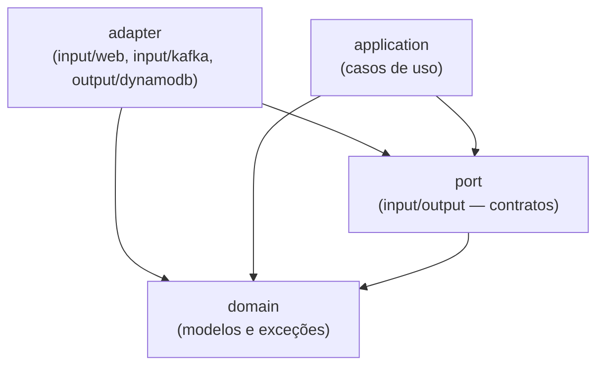
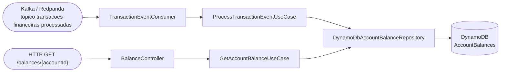

# API de Consulta de Saldo (Desafio Técnico Itaú Unibanco)

API de consulta de saldo de contas bancárias, construída sobre o [itau-code-challange-starter-kit](https://github.com/itau-unibanco/itau-code-challange-starter-kit). Consome transações financeiras de um tópico Kafka, persiste o saldo mais atual no DynamoDB com controle de concorrência, e expõe um endpoint REST para consulta.

## Sumário

- [Stack](#stack)
- [Arquitetura](#arquitetura)
- [Estrutura de pastas](#estrutura-de-pastas)
- [Endpoints da API](#endpoints-da-api)
- [Mensageria Kafka](#mensageria-kafka)
- [Imagens Docker utilizadas](#imagens-docker-utilizadas)
- [Variáveis de ambiente](#variáveis-de-ambiente)
- [Como rodar](#como-rodar)
- [Comandos do Makefile](#comandos-do-makefile)
- [Testes](#testes)
- [Cobertura de testes](#cobertura-de-testes)
- [Decisões de implementação](#decisões-de-implementação)

## Stack

| Categoria | Tecnologia |
|-|-|
| Linguagem | Java 21 |
| Runtime | Java 21 (Eclipse Temurin) |
| Framework | Spring Boot 4.1.0 (Spring Framework 7) |
| Build | Gradle 9.5.1 (Groovy DSL) |
| Web | Spring MVC (`spring-boot-starter-webmvc`) |
| Serialização JSON | Jackson (`com.fasterxml.jackson` para anotações, `tools.jackson` para databind) |
| Banco de dados | Amazon DynamoDB (via AWS SDK for Java v2) |
| Mensageria | Kafka (protocolo) via Spring Kafka, broker real = Redpanda |
| Resiliência | Resilience4j (retry com backoff exponencial) |
| Testes | JUnit 5, Mockito, AssertJ, ArchUnit (teste de arquitetura), MockMvc |
| Cobertura | JaCoCo (gate mínimo de 90% de instruções) |
| Containers | Docker + Docker Compose |

## Arquitetura

O projeto segue **arquitetura hexagonal**: o núcleo do negócio (domínio) não depende de nenhum framework, banco de dados ou broker de mensagens. Toda comunicação com o mundo externo passa por **portas** (interfaces) implementadas por **adaptadores**. A regra de dependência é sempre unidirecional, em direção ao domínio.



*As setas indicam "depende de" — sempre apontando em direção ao domínio.*

Essa regra é validada automaticamente por um **teste de arquitetura** (`HexagonalArchitectureTest`, usando a lib [ArchUnit](https://www.archunit.org/)), que quebra o build caso alguma camada viole a direção de dependência esperada — por exemplo, se `domain` importar algo do Spring, ou se `application` importar um `adapter` diretamente.

### Camadas

#### 1. `domain` — núcleo do negócio
Modelos e exceções de domínio, sem nenhuma dependência externa (nem Spring).

- `domain/model/AccountBalance.java` — o saldo de uma conta (accountId, owner, amount, currency, updatedAt).
- `domain/model/TransactionEvent.java` — uma transação financeira recebida via Kafka, já traduzida para o domínio.
- `domain/model/TransactionType.java` / `TransactionStatus.java` — enums de tipo (CREDIT/DEBIT) e status (APPROVED/DECLINED).
- `domain/exception/AccountNotFoundException.java` — conta não encontrada na consulta de saldo.

#### 2. `port` — contratos do hexágono
Interfaces que definem a borda entre o núcleo e o mundo externo.

- **`port/input`** (portas de entrada / *driving*) — o que a aplicação **oferece**:
  - `GetAccountBalanceUseCase` — obter o saldo mais atual de uma conta.
  - `ProcessTransactionEventUseCase` — processar uma transação recebida via Kafka.
- **`port/output`** (portas de saída / *driven*) — o que a aplicação **precisa**:
  - `AccountBalanceRepository` — buscar saldo por conta, e persistir um novo saldo apenas se for mais recente que o já armazenado (`saveIfNewer`).

#### 3. `application` — casos de uso
Implementa os *input ports*, orquestrando regras de negócio usando apenas `domain` e `port` (nunca conhece detalhes de HTTP, Kafka ou DynamoDB).

- `AccountBalanceQueryService` — busca o saldo da conta; lança `AccountNotFoundException` se não existir.
- `TransactionEventProcessingService` — converte o evento de transação recebido em um `AccountBalance` e delega ao repositório a decisão de persistir (a checagem de "é mais recente?" acontece de forma atômica na camada de adapter, não aqui — veja [Decisões de implementação](#decisões-de-implementação)).

#### 4. `adapter` — integrações com o mundo externo
Implementações concretas das portas, organizadas por tecnologia. Cada adaptador é isolado — trocar um por outro não exige alterar `domain` nem `application`.

- **`adapter/input/web`** (*driving adapter*, HTTP):
  - `BalanceController` — expõe `GET /balances/{accountId}`, sempre responde em JSON.
  - `GlobalExceptionHandler` — traduz `AccountNotFoundException` para `404 Not Found`.
- **`adapter/input/kafka`** (*driving adapter*, mensageria):
  - `TransactionEventConsumer` — `@KafkaListener` que consome o tópico `transacoes-financeiras-processadas`, desserializa a mensagem, descarta mensagens malformadas/inválidas (logando o erro, sem derrubar o consumer) e chama `ProcessTransactionEventUseCase`.
  - `TransactionEventMapper` — converte o payload cru do Kafka (DTO) para o modelo de domínio (`TransactionEvent`), incluindo a conversão do timestamp de microssegundos para `Instant`.
- **`adapter/output/dynamodb`** (*driven adapter*, persistência):
  - `DynamoDbAccountBalanceRepository` — implementa `AccountBalanceRepository`: `GetItem` para consulta, `PutItem` condicional para escrita (ver [Tratamento de concorrência](#tratamento-de-concorrência)), com retry via Resilience4j.
  - `DynamoDbConfig` — configura o `DynamoDbClient` (endpoint, região, credenciais locais) e o `Retry` do Resilience4j.

### Fluxo de dados



Ou seja: transações chegam via Kafka e atualizam o saldo no DynamoDB (respeitando ordem/concorrência); o endpoint HTTP consulta diretamente o saldo mais atual já persistido.

## Estrutura de pastas

```
src/main/java/br/com/itau/challenge/
├── Application.java                        # bootstrap Spring Boot
└── hello/
    ├── domain/                             # modelos e exceções de domínio
    ├── port/{input,output}/                # contratos (interfaces)
    ├── application/                        # casos de uso
    └── adapter/
        ├── input/{web,kafka}/              # driving adapters
        └── output/dynamodb/                # driven adapters

src/test/java/                              # testes unitários (sem infra externa)
src/integrationTest/java/                   # testes de integração (infra real via Docker)

infra/                                       # seeds de infraestrutura local (Docker Compose)
├── dynamodb/                               # script de criação da tabela AccountBalances
└── redpanda/                               # script de criação do tópico transacoes-financeiras-processadas

http/                                       # arquivos .http para chamar a API manualmente
```

## Endpoints da API

### `GET /balances/{accountId}`

Retorna o saldo mais atual de uma conta. **Sempre responde em JSON**, inclusive em erros.

| Parâmetro | Local | Tipo | Descrição |
|-|-|-|-|
| `accountId` | Path | UUID | Identificador da conta |

**Sucesso:**
```
GET /balances/5b19c8b6-0cc4-4c72-a989-0c2ee15fa975
200 OK
{
  "id": "5b19c8b6-0cc4-4c72-a989-0c2ee15fa975",
  "owner": "315e3cfe-f4af-4cd2-b298-a449e614349a",
  "balance": {
    "amount": 183.12,
    "currency": "BRL"
  },
  "updated_at": "2025-07-05T18:04:13.433-03:00"
}
```

**Erros:**
- `404 Not Found` — conta não encontrada.
- `400 Bad Request` — `accountId` não é um UUID válido.

## Mensageria Kafka

### Tópico `transacoes-financeiras-processadas` (entrada)

Transações financeiras entram pelo Kafka, não por HTTP: `TransactionEventConsumer` escuta o tópico `transacoes-financeiras-processadas` e atualiza o saldo da conta via `ProcessTransactionEventUseCase`. Cada mensagem representa uma transação de crédito ou débito (aprovada ou rejeitada) e inclui o saldo mais atual do cliente, com timestamp em **microssegundos**.

**Schema da mensagem (JSON):**
```json
{
  "transaction": {
    "id": "8e8ae808-b154-48b5-9f3e-553935cc4543",
    "type": "CREDIT",
    "amount": 97.07,
    "currency": "BRL",
    "status": "APPROVED",
    "timestamp": 1751641364589998
  },
  "account": {
    "id": "5b19c8b6-0cc4-4c72-a989-0c2ee15fa975",
    "owner": "315e3cfe-f4af-4cd2-b298-a449e614349a",
    "created_at": 1634874339000000,
    "status": "ENABLED",
    "balance": {
      "amount": 183.12,
      "currency": "BRL"
    }
  }
}
```

**Como publicar mensagens de teste:**
- `make kafka-produce-transactions-events TOPIC=transacoes-financeiras-processadas COUNT=50` — gera transações aleatórias.
- Pelo Redpanda Console (http://localhost:8081) → tópico `transacoes-financeiras-processadas` → *Produce Message* — para testar payloads específicos manualmente.

**Mensagens malformadas ou inválidas** (JSON quebrado, enum desconhecido, UUID inválido) são descartadas e logadas (nível `ERROR`), sem derrubar o consumer.

## Imagens Docker utilizadas

| Serviço | Imagem | Finalidade |
|-|-|-|
| `app` | build local (`eclipse-temurin:21-jdk` → `eclipse-temurin:21-jre`) | a própria aplicação |
| `dynamodb` | `amazon/dynamodb-local:3.3.0` | DynamoDB local (modo in-memory) |
| `dynamodb-seed` | `amazon/aws-cli:2.36.8` | cria a tabela `AccountBalances` |
| `dynamodb-admin` | `aaronshaf/dynamodb-admin:5.3.4` | console web para inspecionar a tabela |
| `redpanda` | `docker.redpanda.com/redpandadata/redpanda:v26.1.14` | broker Kafka-compatível (modo KRaft, single-node) |
| `redpanda-seed` | `docker.redpanda.com/redpandadata/redpanda:v26.1.14` | aplica a config do cluster (`config.sh`), depois cria o tópico `transacoes-financeiras-processadas` (`seed.sh`), usando `rpk` |
| `redpanda-console` | `docker.redpanda.com/redpandadata/console:v3.9.0` | console web para inspecionar tópicos/mensagens |

> Todas as imagens usam versões fixas (nunca `latest`) para builds reprodutíveis.

> **Por que Redpanda em vez do Apache Kafka?** É um binário único em C++ (sem JVM, sem ZooKeeper), com startup quase instantâneo — mais leve para ambiente local, mantendo 100% de compatibilidade com o protocolo Kafka (a aplicação usa `spring-kafka` normalmente, sem nenhum código específico do Redpanda).

## Variáveis de ambiente

Todas têm valor padrão para desenvolvimento local (fora do Docker Compose) e são sobrescritas dentro do `docker-compose.yml` para apontar para os hostnames internos dos containers.

| Variável | Padrão (local) | Descrição |
|-|-|-|
| `DYNAMODB_ENDPOINT` | `http://localhost:8000` | endpoint do DynamoDB |
| `DYNAMODB_REGION` | `us-east-1` | região (fake, para o SDK) |
| `BALANCE_TABLE_NAME` | `AccountBalances` | tabela do DynamoDB |
| `KAFKA_BOOTSTRAP_SERVERS` | `localhost:19092` | broker Kafka/Redpanda |
| `KAFKA_CONSUMER_GROUP_ID` | `balance-transaction-consumer` | group id do consumer |
| `TRANSACTIONS_TOPIC` | `transacoes-financeiras-processadas` | tópico consumido |

## Como rodar

Pré-requisito único: **Docker** (com Docker Compose). O `make` já vem instalado por padrão em Linux e macOS; no Windows, use o **WSL2** (o Makefile depende de utilitários estilo Unix e não roda direto no PowerShell/cmd).

```bash
make up      # sobe tudo em background: app + DynamoDB + Redpanda (+ seeds + consoles)
make logs    # acompanha os logs da aplicação
make kafka-produce-transactions-events TOPIC=transacoes-financeiras-processadas COUNT=10
curl "http://localhost:8080/balances/{accountId}"   # accountId disponível no DynamoDB Admin
make stop    # derruba tudo
```

Consoles web disponíveis depois de subir a stack:

| Console | URL |
|-|-|
| Aplicação | http://localhost:8080 |
| DynamoDB Admin | http://localhost:8001 |
| Redpanda Console | http://localhost:8081 |

### Loop de desenvolvimento rápido (rodando pela IDE)

Para iterar mais rápido durante o desenvolvimento — com debugger, breakpoints e sem reconstruir a imagem Docker a cada mudança — rode a aplicação direto pela IDE em vez de `make up`/`make run`:

```bash
make db-up     # só DynamoDB Local + console web
make kafka-up  # só Redpanda + console web
```

Esses comandos retornam assim que os containers **sobem**, não quando os jobs de seed **terminam** — espere alguns segundos (acompanhe com `make logs` ou pelos consoles web) antes de rodar a aplicação, senão ela pode consultar a tabela/tópico antes de estarem populados.

Depois rode `Application.java` (ou `./gradlew bootRun`) direto pela IDE. Os valores padrão em `application.yaml` (`localhost:8000` para o DynamoDB, `localhost:19092` para o Redpanda) já apontam para essas portas — nenhuma variável de ambiente extra é necessária.

### Solução de problemas

- **Primeiro `make up` demorando:** na primeira execução o Docker baixa ~5 imagens (`dynamodb-local`, `aws-cli`, `redpanda`, `redpanda-console`, `dynamodb-admin`), então pode levar alguns minutos dependendo da sua internet. Acompanhe com `make logs` — se não houver progresso nenhum por vários minutos, aí sim algo está errado.
- **Erro `port is already allocated` / `address already in use`:** a stack ocupa as portas `8080` (app), `8000`/`8001` (DynamoDB), `8081` (Redpanda Console) e `9092`/`19092` (Redpanda). Libere a porta em conflito (encerrando o processo que a está usando) ou pare qualquer outra stack local que já esteja rodando.
- **Ficou algo travado/inconsistente:** `make clean-containers` remove todos os containers do projeto (rodando ou parados, incluindo órfãos) para você começar do zero.

## Comandos do Makefile

Execute `make help` a qualquer momento para ver esta lista no terminal.

### Aplicação

| Comando | Descrição |
|-|-|
| `make build` | constrói a imagem Docker de runtime da aplicação |
| `make run` | sobe a stack em primeiro plano (logs no terminal) |
| `make up` | sobe a stack em background |
| `make logs` | acompanha os logs da aplicação (`docker compose logs -f`) |
| `make stop` | derruba os containers da stack (`docker compose down`) |
| `make http` | chama os arquivos `.http` contra a app rodando (via container Node, sem dependência local) |

### DynamoDB

| Comando | Descrição |
|-|-|
| `make db-up` | sobe o DynamoDB Local + console web e cria a tabela `AccountBalances` |
| `make db-seed` | roda novamente o job de criação da tabela (idempotente) |
| `make db-scan` | lista todos os itens atualmente na tabela |
| `make db-down` | para o DynamoDB Local + console web |

### Kafka / Redpanda

> **Nota:** a criação automática de tópicos (`auto_create_topics_enabled`) fica desabilitada por `infra/redpanda/config.sh` logo que o cluster sobe (roda antes de `seed.sh`, no mesmo container `redpanda-seed`). Ou seja, tópicos precisam ser criados explicitamente — via `make kafka-topic-create` ou pelo próprio seed — antes de produzir/consumir mensagens.

| Comando | Descrição |
|-|-|
| `make kafka-up` | sobe o Redpanda + console web e cria o tópico `transacoes-financeiras-processadas` |
| `make kafka-seed` | roda novamente o job de criação do tópico (idempotente) |
| `make kafka-topic-create NAME=meu-topico [PARTITIONS=3]` | cria um novo tópico no Redpanda com o nome e o número de partições informados (`PARTITIONS` é opcional, padrão `1`) |
| `make kafka-produce-accounts-events TOPIC=meu-topico [COUNT=50]` | produz eventos de teste no formato `{"account": {...}}` (id/owner UUID aleatórios, `created_at` aleatório nos últimos 10 minutos, `status` ENABLED/DISABLED aleatório) para o tópico informado (`COUNT` é opcional, padrão `100`) |
| `make kafka-produce-transactions-events TOPIC=meu-topico [COUNT=50]` | produz eventos de teste no formato `{"transaction": {...}, "account": {...}}` (id's UUID aleatórios, `type` CREDIT/DEBIT, `amount` aleatório de 0.01 a 10000, `status` APPROVED/DECLINED, `timestamp` aleatório nos últimos 10 minutos; `account.created_at` aleatório nos últimos 10 anos, `account.status` sempre ENABLED, `balance.amount` aleatório de 0.00 a 20000) para o tópico informado (`COUNT` é opcional, padrão `100`) |
| `make kafka-consume TOPIC=meu-topico` | imprime todas as mensagens atualmente no tópico informado (usa timeout de 5s, já que `rpk topic consume` não tem um modo "ler o que existe e sair") |
| `make kafka-down` | para o Redpanda + console web |

### Testes

| Comando | Descrição |
|-|-|
| `make test` | constrói a imagem de teste e roda `./gradlew check` (testes unitários + gate de cobertura ≥ 90%) dentro de um container — não precisa de nenhuma infra externa |
| `make integration-test` | sobe DynamoDB + Redpanda reais e roda `./gradlew integrationTest` contra eles |

### Limpeza

| Comando | Descrição |
|-|-|
| `make clean-containers` | remove **todos** os containers do projeto (rodando ou parados), incluindo órfãos de serviços renomeados/removidos |
| `make clean` | remove as imagens Docker construídas localmente |

## Testes

O projeto tem duas suítes de teste bem separadas:

### `src/test` — testes unitários (`./gradlew test`)
Não dependem de nenhuma infraestrutura externa — rodam em qualquer lugar, inclusive dentro do container Docker de teste (`make test`), sem Docker-in-Docker.

- Testes de domínio, aplicação e adapters usando **fakes/mocks** para os *ports* (nenhuma chamada real a DynamoDB ou Kafka).
- `AccountBalanceQueryServiceTest` / `TransactionEventProcessingServiceTest` — testam os casos de uso com mocks do repositório.
- `TransactionEventConsumerTest` — cobre mensagem válida, JSON malformado e enum inválido.
- `BalanceControllerTest` — usa `MockMvc` + `@MockitoBean` para isolar a camada web (sucesso, conta não encontrada, UUID inválido).
- `DynamoDbAccountBalanceRepositoryTest` — cobre leitura, escrita, rejeição condicional e comportamento de retry, com o `DynamoDbClient` mockado.
- `HexagonalArchitectureTest` valida a direção de dependências entre as camadas (ArchUnit).

### `src/integrationTest` — testes de integração (`./gradlew integrationTest`)
Rodam contra infraestrutura **real**, subida via Docker Compose. Ficam propositalmente fora do `check`/`test` para não exigir infra no pipeline padrão.

- `DynamoDbAccountBalanceIntegrationTest` — grava e lê de uma tabela DynamoDB real (`make db-up`), incluindo os cenários de **transação fora de ordem** e **transação duplicada** sendo corretamente descartadas.

Rode com `make integration-test` (sobe a infra necessária automaticamente antes de executar).

## Cobertura de testes

Configurado com **JaCoCo**, gate mínimo de **90% de cobertura de instruções**, que falha o build (`./gradlew check`) se não for atingido. Um resumo legível é impresso diretamente no output do Gradle (sem precisar abrir o relatório HTML), com contagem por tipo de métrica (instruções, branches, linhas, complexidade, métodos, classes) e o veredito do gate.

Relatório HTML completo em `build/reports/jacoco/test/html/index.html` após rodar `./gradlew test` ou `make test`.

## Decisões de implementação

### Modelagem de dados no DynamoDB

**Tabela `AccountBalances`:**

| Atributo | Tipo | Papel |
|-|-|-|
| `accountId` | String (UUID) | Partition key |
| `owner` | String (UUID) | Atributo |
| `amount` | Number | Atributo |
| `currency` | String | Atributo |
| `updatedAt` | Number (epoch microssegundos) | Atributo |

**Por que `accountId` como partition key, sem sort key:** o único padrão de acesso exigido é `GET /balances/{accountId}` — "o saldo mais atual da conta". Isso é uma consulta de **estado atual**, não um histórico de transações. Um item por conta, sobrescrito a cada atualização, atende esse padrão de acesso com uma leitura O(1) via `GetItem`, sem necessidade de `Query` nem de índice secundário.

Uma alternativa considerada foi manter um histórico completo de transações (sort key = `updatedAt` ou `transactionId`), com uma projeção/GSI para "pegar o item mais recente". Isso foi descartado por dois motivos: (1) o contrato de resposta não pede histórico, só o saldo atual; (2) manter um item único por conta é o que torna o `ConditionExpression` descrito abaixo possível de forma simples e atômica — com múltiplos itens por conta, a comparação "é isso mais recente?" exigiria uma leitura prévia (race condition) ou lógica bem mais complexa.

**Por que `updatedAt` como Number (epoch microssegundos), não String:** o payload do Kafka já entrega o timestamp da transação em microssegundos. Persistir como Number permite que o `ConditionExpression` compare os valores numericamente de forma nativa e sem ambiguidade de fuso horário, evitando qualquer bug sutil de comparação lexicográfica de strings.

### Tratamento de concorrência

O maior risco do domínio é duas transações da mesma conta chegando fora de ordem (ou duplicadas) — por exemplo, se caírem em partições diferentes do tópico Kafka, ou por retry do publisher. A estratégia escolhida foi um **upsert condicional atômico** no `PutItem`, usando:

```
attribute_not_exists(accountId) OR updatedAt < :newUpdatedAt
```

Isso resolve o problema **sem lock distribuído e sem leitura prévia**: o próprio DynamoDB rejeita a escrita (`ConditionalCheckFailedException`) se já existir um saldo com `updatedAt` igual ou mais recente que o que está chegando. Isso cobre, de forma unificada:

- **Mensagens fora de ordem**: uma transação mais antiga que chega depois de uma mais nova é descartada.
- **Mensagens duplicadas**: reprocessar a mesma transação (mesmo `updatedAt`) não sobrescreve nada — a condição `<` (estrita) não passa quando os valores são iguais.

Essa abordagem foi escolhida em vez de "ler o saldo atual, comparar em memória, decidir se escreve" porque essa segunda abordagem tem uma race condition clássica: entre o `GetItem` e o `PutItem`, outra transação concorrente pode ter escrito um valor mais recente, e a checagem em memória ficaria obsoleta. O `ConditionExpression` evita esse problema por ser avaliado atomicamente pelo próprio DynamoDB no momento da escrita.

Cobertura de teste: `DynamoDbAccountBalanceIntegrationTest` valida esse comportamento contra uma instância real do DynamoDB Local, simulando explicitamente os cenários de mensagem fora de ordem e duplicada.

### Resiliência

- **Retry com backoff exponencial** (Resilience4j) nas operações de leitura/escrita no DynamoDB, para falhas transitórias (throttling, timeout de rede). Configurado com 3 tentativas e backoff exponencial a partir de 200ms.
- `ConditionalCheckFailedException` é **explicitamente excluída** do retry: ela representa uma rejeição de negócio válida (mensagem obsoleta/duplicada), não uma falha transitória — tentar de novo não mudaria o resultado e só adicionaria latência.
- **Tratamento de "poison pill" no consumer Kafka**: mensagens malformadas (JSON inválido) ou com dados inválidos (enum desconhecido, UUID inválido) são capturadas, logadas e descartadas — sem propagar a exceção. Isso evita que uma única mensagem corrompida trave o consumer inteiro em retry infinito, o que bloquearia o processamento de todas as mensagens seguintes no tópico.
- **Circuit breaker**: avaliado e **não implementado**. O motivo: circuit breaker existe para proteger o sistema de uma dependência que está *consistentemente* falhando, evitando sobrecarregar ainda mais um serviço já degradado. No desenho atual, a única dependência síncrona externa é o próprio DynamoDB, já protegido por retry com backoff; não há uma chamada síncrona em cadeia (ex: chamar outro microsserviço) onde um circuit breaker traria benefício adicional relevante. Se a aplicação evoluísse para consultar outro serviço (ex: validação de conta em um serviço de cadastro), a recomendação seria adicionar `Resilience4j CircuitBreaker` nesse ponto específico.

### Logging

Pontos-chave da aplicação emitem logs estruturados:
- Descarte de mensagem malformada ou inválida no consumer Kafka (nível `ERROR`, com a causa).
- Descarte de transação obsoleta/duplicada no repository (nível `INFO`, com `accountId` e `updatedAt`).

Esses logs usam o formato padrão do Spring Boot (via Logback), compatível com qualquer stack de agregação de logs (ex: ELK, CloudWatch Logs) sem configuração adicional.
